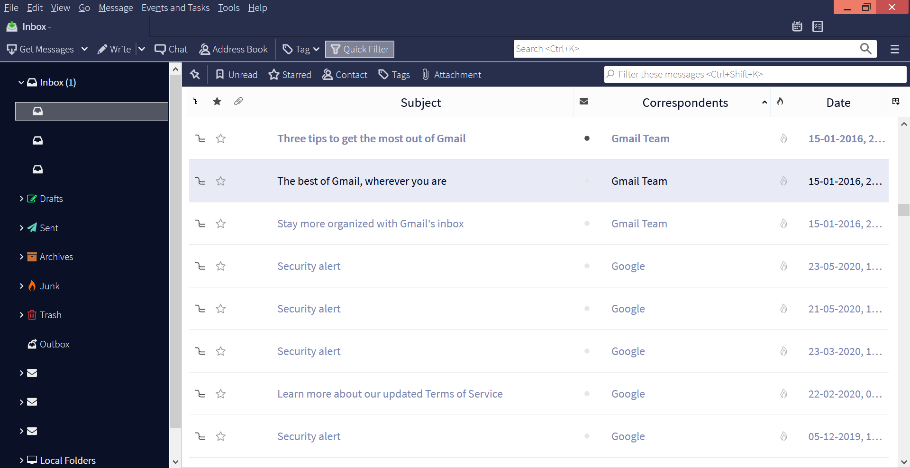

# Thunderbird Themes

This repository currently hosts the Onyx theme, a Thunderbird theme that I have created from a fork of [Matthew Richardson's implementation](https://github.com/spymastermatt/thunderbird-monterail) of the [Monterail Thunderbird mockup](https://monterail.com/blog/2016/the-power-of-email-clients-why-did-we-redesign-thunderbird?utm_source=Thunderbird&utm_campaign=Dribbble&utm_medium=blogpost%22). It includes a modified userChrome.css file to change Thunderbird's look that is my own redesign, unrelated to the original design inspiration. This project is licensed under the GNU General Public License, version 3,  just like the original source code. In the future, other themes may be added.

* The fonts Source Sans Pro Light and Source Sans Pro Regular have been included in this project as .ttf files.
* Also included is a set of svg icons which replace the default Thunderbird icons, mostly taken from the incredible Font-Awesome (http://fontawesome.io)

## How to use these themes
To use these themes, download the source code as a zip and extract its contents to your
Thunderbird user config directory.

In **Windows OS** the chrome folder must be extracted in `C:\Users\[user]\AppData\Roaming\Thunderbird\Profiles\[random letters and numbers].default/`

In **Linux** it must be extracted in `/home/[user]/.thunderbird/[random letters and numbers].default/`

In **macOS (OSX)**, it must be extracted in `/home/[user]/Library/Thunderbird/Profiles/[random letters and numbers].default/`.

If your profile is located in a different directory, you can find it by going in Thunderbird's preferences (Tools->Options->Advanced). After that, click the 'Config Editor' button, accept the warning and then search for *directory*. Your directory should be the value of the parameter *mail.server.server1.directory*. This is the path where you should extract the chrome folder.

Rename the extracted folder to *chrome*, edit userChrome.css to choose your theme variant, and restart Thunderbird. 

You can customize various values, including almost all colors, the fonts and some of the sizing by editing the variables in userChrome.css

## Screenshots
Onyx:

Please note that:

* Certain parts of the above screenshot have been altered to remove personally identifiable information. The parts are located in the tab containing the text "Inbox - " and the folder pane. In both cases, the altered areas display email IDs.
* The first email in the message pane is unread, while the second image has been selected.
* The [Thunderbird Conversations add-on](https://addons.thunderbird.net/en-US/thunderbird/addon/gmail-conversation-view/?src=ss?src=ss) has been used in this view.
* The messages are currently in Threaded view and sorted in ascending order by Correspondents, while the folders are currently in Unified View. Changes in either the add-on settings or the view settings may lead to different viewing results.

## To be fixed

*  Calendar and Tasks tabs still carry over the theme settings from the original Full Dark Monterail theme. Settings more appropriate to Onyx may be added in future versions.\
* Currently, several rules work by overriding existing rules. Code needs to be cleaned to remove rule clashes.

## Contributions

Further contributions building off the current theme files are welcome. Minor changes or changes that contribute towards minor improvements in the Onyx theme while still maintaining Onyx's overall aesthetic ideals will be merged with the original Onyx code, else they will be classified as a separate Theme and added as a separate `.css` file in themes.

## Revisions

Changes from Matthew Richardson's original source code have been made in the `userChrome.css`, `onyx.css`, and `_base.css` files to change color combinations and other theme settings for Thunderbird. The modified `fulldark.css` has been renamed to `onyx.css` and other changes have been made to the `screenshots` and `fonts` folders to add and remove files relevant to this fork. Relevant instructions and information has been changed as per this fork's requirements in `README.md`.

## Copyright Notice

Revisions: © 2020 Sagnik Anupam

Original Code: ©  2017 Matthew Richardson